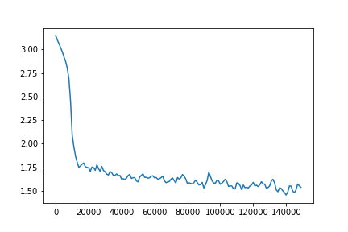
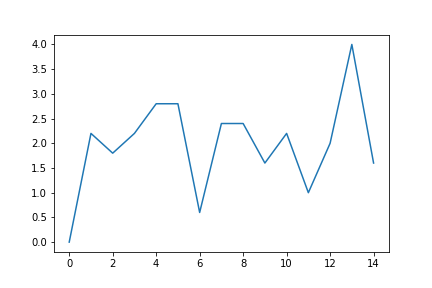

Using human demonstration data, a convolutional neural network is trained to take the current state as input and give the action as output. 

In order to discretize actions, Kmeans is used to cluster actions into 24 groups. 

### Experimentation Results ###

For experimentation, MineRLTreechopVectorObf-v0 environment data is used to train the model. The following graphs show the loss and return over 140000 iterations.

#### Training Loss ####
 

#### Training Returns ####

